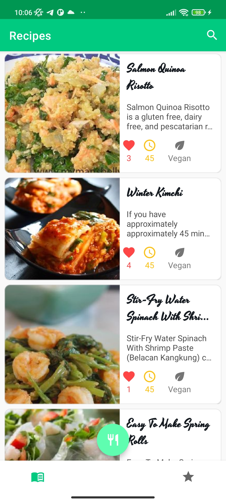
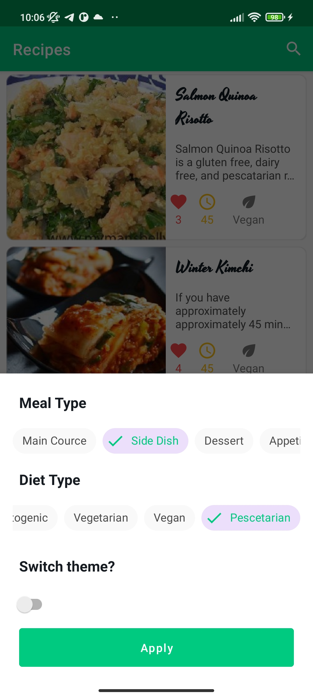
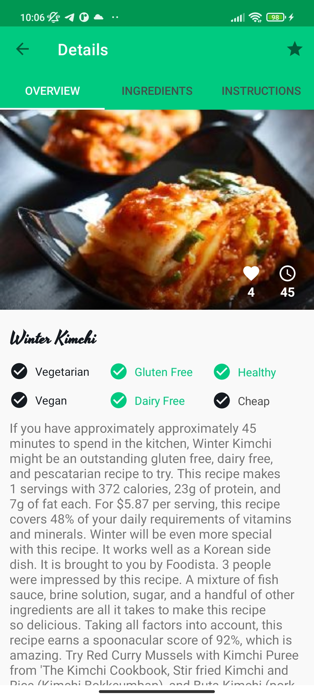
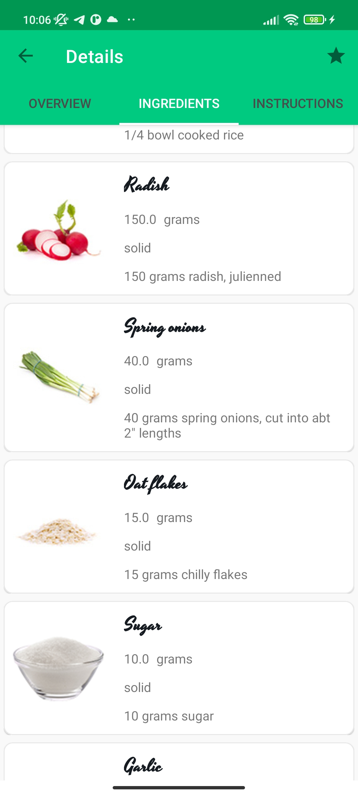
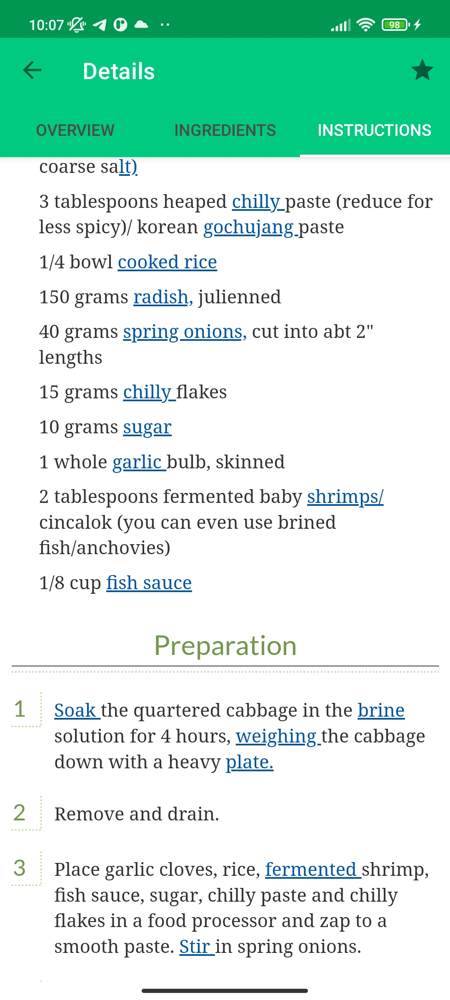
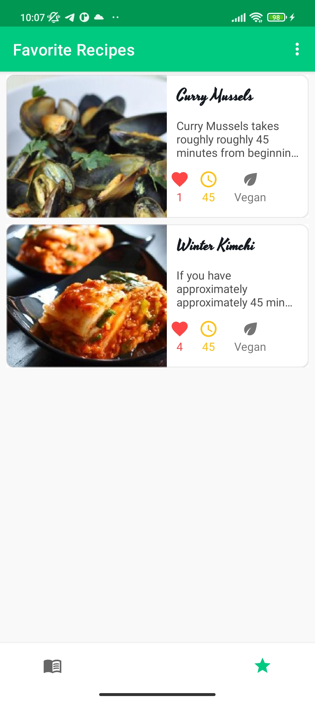
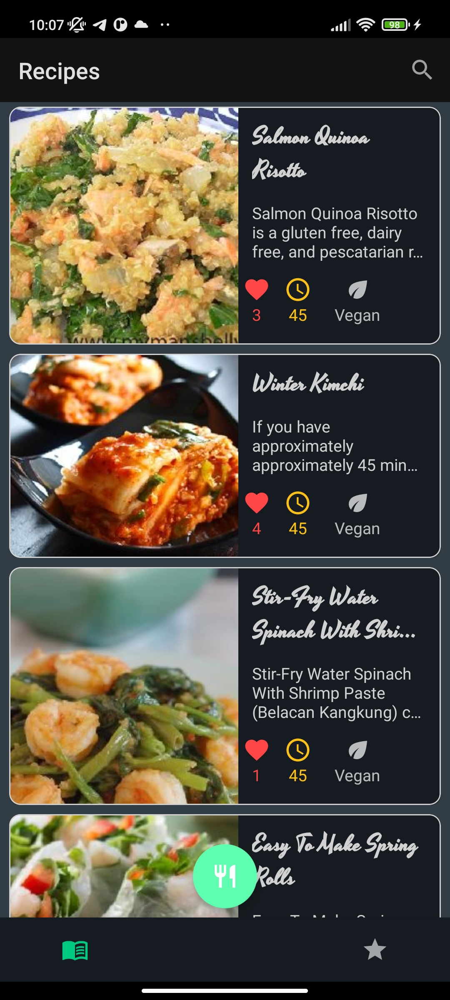
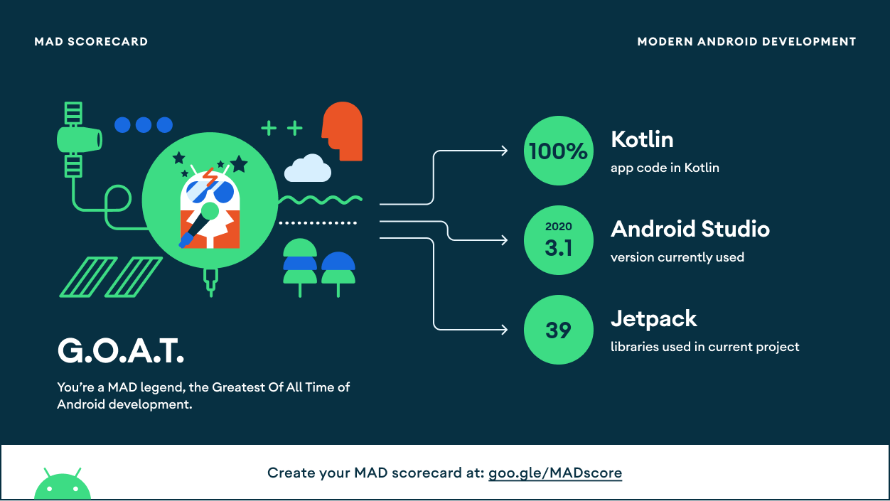

<h1>Food Recipes App</h1>


This is an app for finding culinary recipes. For each recipe you will be able to see a list of required products and a cooking recipe

## Screenshots

<p>







</p>

## Preparing to work with the application

Add your [Spoonacular](https://spoonacular.com//) API key in the `Constants` file:

```
API_KEY=YOUR_API_KEY
```

## Features


- Search for recipes
- View recipe details like cooking time, rating, overview, 
- Adding recipe to favorites
- Sort by meal type, diet type
- Change dark and light themes
- Works offline by caching data into a database
.

## Tech stack & Open-source libraries

- [Kotlin](https://kotlinlang.org/) based, [Coroutines](https://github.com/Kotlin/kotlinx.coroutines) + [Flow](https://kotlin.github.io/kotlinx.coroutines/kotlinx-coroutines-core/kotlinx.coroutines.flow/) for asynchronous.
- Hilt (alpha) for dependency injection.
- JetPack
  - LiveData - notify domain layer data to views.
  - Lifecycle - dispose of observing data when lifecycle state changes.
  - ViewModel - UI related data holder, lifecycle aware.
  - Room Persistence - construct a database using the abstract layer.
- Architecture
  - MVVM Architecture (View - DataBinding - ViewModel - Model)
  - Repository pattern
- [Retrofit2 & OkHttp3](https://github.com/square/retrofit) - construct the REST APIs and paging network data.
- [Gson](https://github.com/square/gson/) - A modern JSON library for Kotlin and Java.
- [Coil](https://coil-kt.github.io/coil/) - loading images.
- [Material-Components](https://github.com/material-components/material-components-android) - Material design components like ripple animation, cardView.
- [Shimmer Recycle View](https://github.com/omtodkar/ShimmerRecyclerView) - Shimmer effect for recycle views.

 ## MAD Score
  
  

## Architecture

App is based on MVVM architecture and a repository pattern.


## Open API


[Spoonacular API](https://spoonacular.com/food-api) for constructing RESTful API.<br>
Spoonacular API provides a RESTful API interface to highly detailed objects built from thousands of lines of data related to Recipes.
